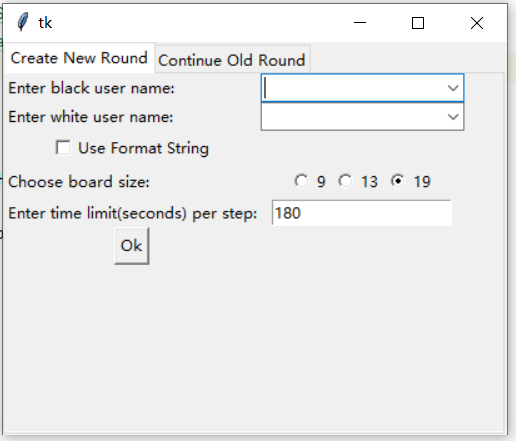
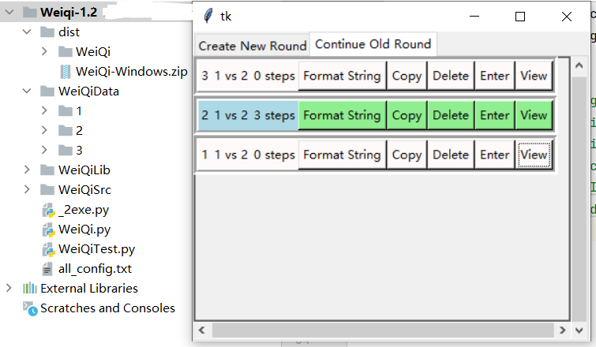
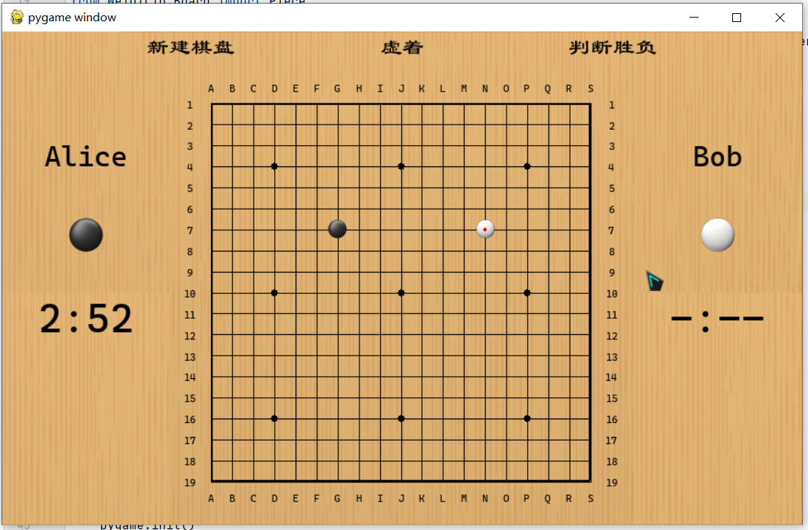

# Weiqi
### Main Features
1. Definite User Name of Black player and White player
2. Use Format String to import an existing situation
3. Choose board size: 9x9, 13x13 or 19x19
4. Limit the cost time of every step
5. Use Mouse to play
6. Skip one step
7. Judge the winner of this situation
8. Auto Save and manage the old situations, such as, export their format strings, copy, delete, load/enter an old situation to play, and view

